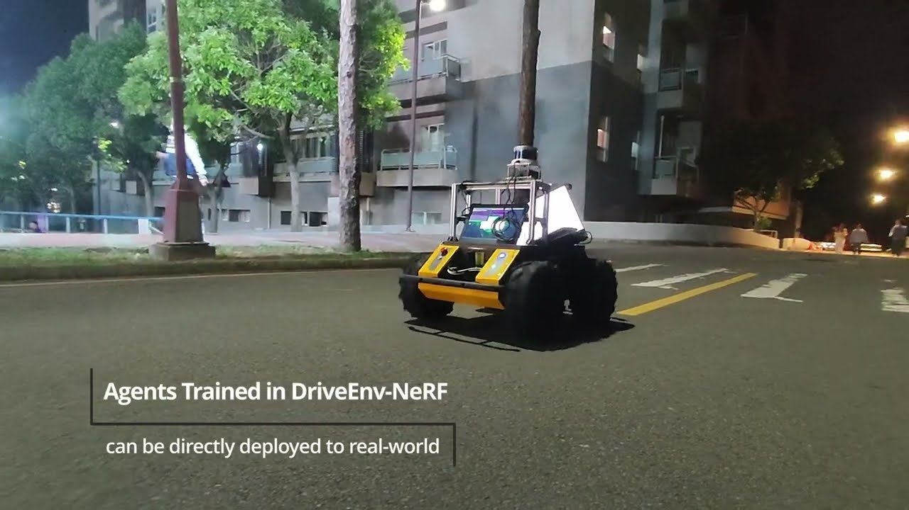

# DriveEnv-NeRF: Exploration of A NeRF-Based Autonomous Driving Environment for Real-World Performance Validation

### [Project Page](https://muyishen2040.github.io/DriveEnvNeRF) | [Video](https://youtu.be/8wNflV_A5FM) | [Paper](https://arxiv.org/abs/2403.15791)

[](https://arxiv.org/abs/2403.15791)<br>

This is the repository that contains source code for the [DriveEnv-NeRF website](https://muyishen2040.github.io/DriveEnvNeRF).

## [Demo Video](https://youtu.be/8wNflV_A5FM)

[](https://youtu.be/8wNflV_A5FM)

## Abstract

In this study, we introduce the DriveEnv-NeRF framework, which leverages Neural Radiance Fields (NeRF) to enable the validation and faithful forecasting of the efficacy of autonomous driving agents in a targeted real-world scene. Standard simulator-based rendering often fails to accurately reflect real-world performance due to the sim-to-real gap, which represents the disparity between virtual simulations and real-world conditions. To mitigate this gap, we propose a workflow for building a high-fidelity simulation environment of the targeted real-world scene using NeRF. This approach is capable of rendering realistic images from novel viewpoints and constructing 3D meshes for emulating collisions. The validation of these capabilities through the comparison of success rates in both simulated and real environments demonstrates the benefits of using DriveEnv-NeRF as a real-world performance indicator. Furthermore, the DriveEnv-NeRF framework can serve as a training environment for autonomous driving agents under various lighting conditions. This approach enhances the robustness of the agents and reduces performance degradation when deployed to the target real scene, compared to agents fully trained using the standard simulator rendering pipeline.

## Framework Overview

The overview figure presents our proposed framework, DriveEnv-NeRF, which is designed to create highly
realistic 3D simulations of a given environment. Initially, we capture videos of the target scene under
various lighting conditions to ensure a comprehensive representation. These videos are processed to
extract frames and generate camera parameters using structure-from-motion techniques. Following this, a
NeRF model is trained with these inputs to produce novel view renderings and 3D meshes of the scene. These
elements serve as the basis for visual observation and physical interactions within the simulation
environment. Appearance embeddings are incorporated into the NeRF model to enhance the realism and
variability of the environment. With DriveEnv-NeRF developed, the framework allows for the full evaluation
and training of a driving policy within this environment. This framework enables the prediction of
real-world performance and the application of the trained driving policy to real-world scenarios directly.


## Citing DriveEnv-NeRF

```sh
@misc{shen2024driveenvnerf,
      title={DriveEnv-NeRF: Exploration of A NeRF-Based Autonomous Driving Environment for Real-World Performance Validation}, 
      author={Mu-Yi Shen and Chia-Chi Hsu and Hao-Yu Hou and Yu-Chen Huang and Wei-Fang Sun and Chia-Che Chang and Yu-Lun Liu and Chun-Yi Lee},
      year={2024},
      eprint={2403.15791},
      archivePrefix={arXiv},
      primaryClass={cs.RO}
}
```

## Open-Source Implementations

We've released a portion of our implementation code in Isaac Sim and Isaac ROS:

- [Omniverse NeRF Extension](https://github.com/j3soon/omni-nerf-extension)

Stay tuned for additional releases in the future.

## Website License

The template of this website is borrowed from [Nerfies](https://github.com/nerfies/nerfies.github.io)

<a rel="license" href="http://creativecommons.org/licenses/by-sa/4.0/"></a><br />This work is licensed under a <a rel="license" href="http://creativecommons.org/licenses/by-sa/4.0/">Creative Commons Attribution-ShareAlike 4.0 International License</a>.
